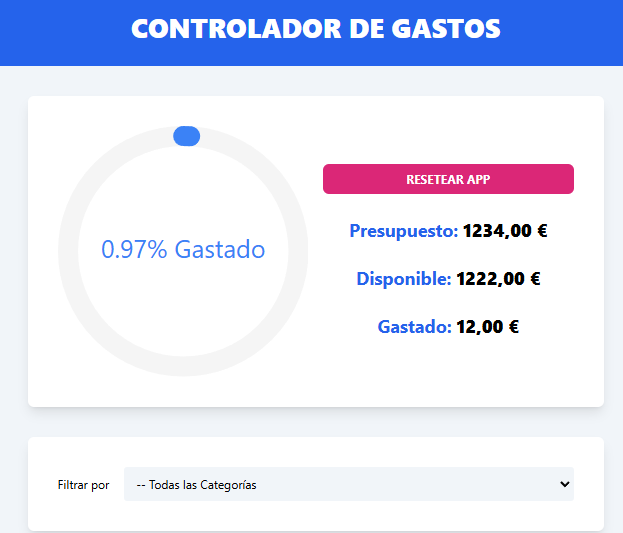

---

# **Controlador de Gastos**

Una aplicación web que permite a los usuarios gestionar su presupuesto y clasificar los gastos por categorías de manera eficiente y visual. Incluye animaciones interactivas y funcionalidades avanzadas para una experiencia intuitiva.

---

## **Características**

- **Gestión de Presupuesto:**
  - Define un presupuesto inicial.
  - Muestra el gasto total, el saldo restante y el porcentaje gastado con una animación circular interactiva.

- **Clasificación de Gastos:**
  - Clasifica gastos en diferentes categorías como ahorro, ocio, etc.
  - Filtros para buscar gastos específicos.

- **Gestión Interactiva de Gastos:**
  - Funcionalidad de **swipe** (deslizar) para aceptar o eliminar gastos, utilizando la librería `react-swipeable-list`.

- **Persistencia de Datos:**
  - Los datos de los gastos pueden almacenarse en una base de datos para su posterior consulta.

- **Diseño Moderno:**
  - Construido con **TailwindCSS** para una interfaz responsiva y estilizada.
  - Uso de **Headless UI** para elementos accesibles y personalizables.

---

## **Captura de Pantalla**

---

## **Tecnologías Utilizadas**

- **React** con **TypeScript**.
- **TailwindCSS** para el diseño responsivo.
- **useReducer y Context API** para la gestión del estado global.
- **react-swipeable-list** para la funcionalidad de deslizar.
- **Headless UI** para componentes accesibles y personalizables.

---

## **Instalación y Ejecución**

Sigue estos pasos para clonar y ejecutar la aplicación en tu entorno local:

1. Clona este repositorio:
   git clone https://github.com/AlexCodeNow/controlador-de-gastos.git

2. Ve al directorio del proyecto:
   cd controlador-gastos

3. Instala las dependencias:
   npm install

4. Inicia la aplicación:
   npm run dev

---

---

## **Retos y Soluciones**

### **Retos**
- Configuración y manejo de **Context API** para la gestión del estado global.
- Implementación de la funcionalidad **swipe** para editar o borrar gastos.
- Uso de **TypeScript** para tipar adecuadamente los datos y reducir errores.

### **Soluciones**
- Uso de `useReducer` en combinación con **Context API** para manejar acciones complejas del estado global.
- Integración de la librería `react-swipeable-list` para mejorar la experiencia de usuario.
- Componentización de la lógica para facilitar su reutilización y mantenimiento.

---

## **Contribuciones**

¡Las contribuciones son bienvenidas! Si deseas mejorar esta aplicación o agregar nuevas características, por favor abre un **issue** o envía un **pull request**.

---

## **Licencia**

Este proyecto está bajo la licencia **MIT**. Consulta el archivo `LICENSE` para más detalles.

---

## **Autor**

Desarrollado por [Alex](https://github.com/AlexCodeNow). Si tienes alguna duda o sugerencia, ¡no dudes en contactarme!

---

